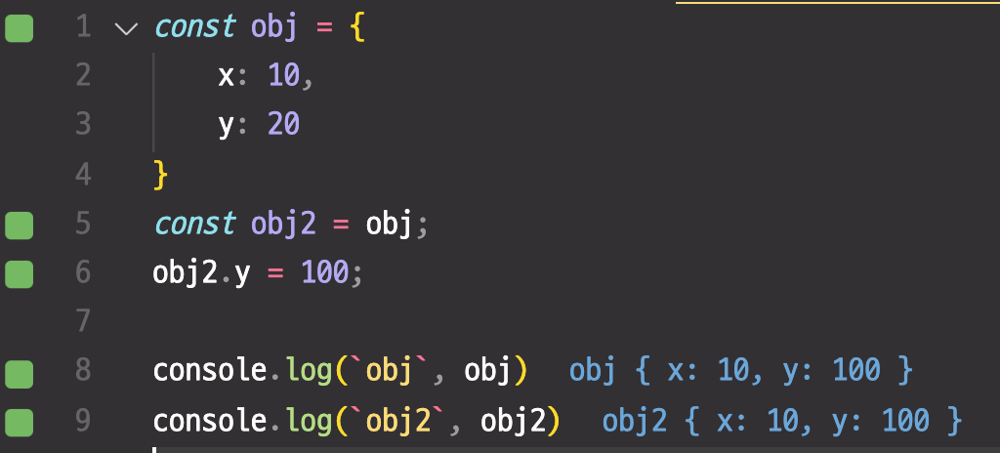

# 들어가며
- 이 내용은 코어 자바스크립트의 강의 중 데이터 타입을 정리한 내용 입니다.
- [강의링크](https://www.inflearn.com/course/%ED%95%B5%EC%8B%AC%EA%B0%9C%EB%85%90-javascript-flow/dashboard)

# Primitive Type
- stack 영역에 저장
- Number, String, Boolean, null, undefined, Symbol(ES6)

## 데이터 저장 방식
- 우선 변수가 선언되면 데이터가 담길 임의의 공간을 확보한다. (1000번)
- 식별자가 obj이니 이름을 obj로 지정한다.
- 변수에 값이 할당되면 할당된 값을 임의의 공간에 저장하고, 변수가 할당된 공간을 찾아서 값이 있는 곳의 주소를 넣는다.
  ```js
  var obj;
  obj = 123; 
  ```

  |주소|1000|1001|1002|1003|1004|1005|1006|1007  
  ---|--|--|--|--|--|--|--|--|
  데이터|이름:obj<br>값:@1007|||||||123

- 만약 값을 바꾸면 새로운 공간의 값을 저장해서 위와 같은 과정을 진행한다.
  ```js
  obj = 456
  ```

  |주소|1000|1001|1002|1003|1004|1005|1006|1007  
  ---|--|--|--|--|--|--|--|--|
  데이터|이름:obj<br>값:@1002||456|||||123


# Reference Type
- heep 영역에 저장
- Object(Function, Array, Set...)

- 우선 변수가 선언되면 데이터가 담길 임의의 공간을 확보한다. (1000번)
- 식별자가 obj이니 이름을 obj로 지정한다.
- `Primitive Type`과 다르게 `Reference Type`은 여러개의 값이 올 수 있으므로 다이렉트로 값을 넣지 못한다. 그래서 한 단계를 더 거친다.
- obj에는 할당될 값의 주소의 범위를 임의로 지정하고, 각 프로퍼티에 대해서 할당한다. 할당하는 방식은 `Primitive Type`과 같다.

  ```js
  var obj;
  obj = {
    x: 3,
    y: 5,
  };
  ```

  |주소|1000|1001|1002|1003|1004|1005|1006|1007  
  ---|--|--|--|--|--|--|--|--|
  데이터|이름:obj<br>값:@1005~?|||3|5|이름:x <br>값:@1003|이름:y <br>값:@1004|


## 주의점
- `Reference Type`은 값을 복사를 했을 때, 복사된 값의 내부 내용을 바꿔도 원본값이 바뀔 수 있다는 점이 있다



# 참조 카운트
- 특정 메모리 영역이 참조되는 횟수 참조 카운트가 0이되면 해당 메모리 영역은 가비지 컬렉터에 수거 대상이 된다.