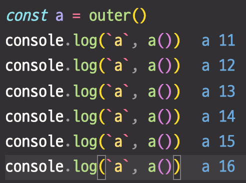

# 들어가며
- 이 내용은 코어 자바스크립트의 강의 중 클로저를 정리한 내용 입니다.
- [강의링크](https://www.inflearn.com/course/%ED%95%B5%EC%8B%AC%EA%B0%9C%EB%85%90-javascript-flow/dashboard)

# 클로저란?

컨텍스트 A에서 선언한 변수 a를 참조하는 내부함수 B를 A의 외부로 전달할 경우, A가 종료된 이후에도 a가 사라지지 않는 현상.
즉 지역변수가 함수 종료 후에도 사라지지 않게 할 수 있음.

아래 함수에서 outer의 반환값은 inner 함수 입니다.
원래 같으면 outer함수가 종료되면 outer의 실행 컨텍스트가 사라져야 되는데, inner쪽에서 outer의 a변수를 참조하므로 func이 함수로 호출될때, outer의 a변수에 대한 정보가 필요합니다.
따라서 outer의 실행 컨택스트가 남아있게 됩니다.

```js
function outer(){
    var a = 10;
    function inner() {
        a++;
        return a;
    } 

    return inner;
}
const func = outer()
```




재미있는점은 a라는 변수는 inner에서 조작이 가능하지만 밖에서는 접근이 불가하다. 이점을 이용하면 캡슐화를 할 수 있다.
